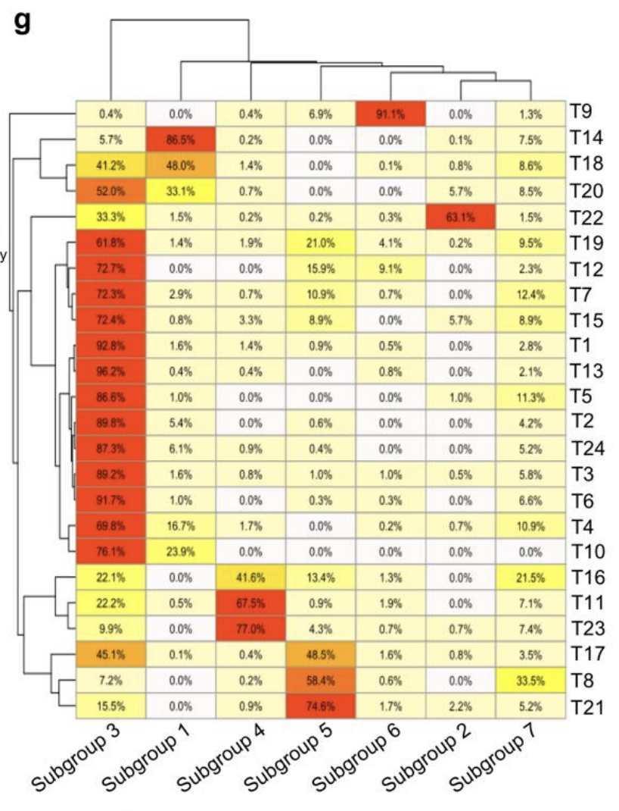
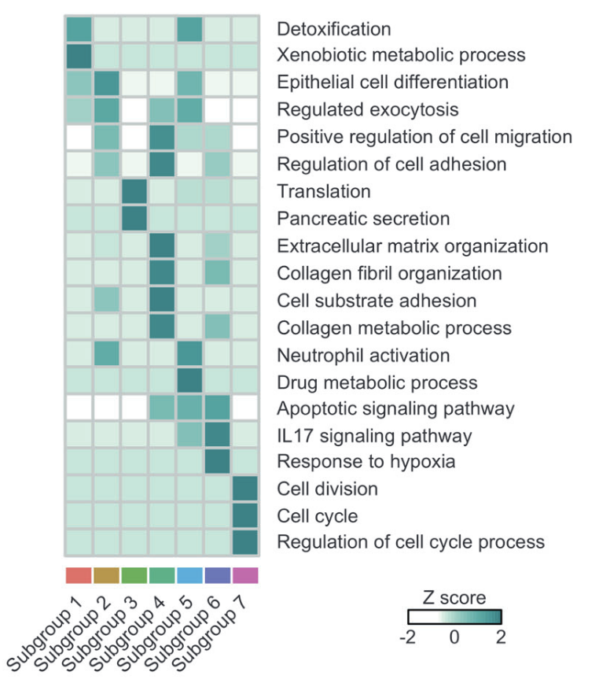
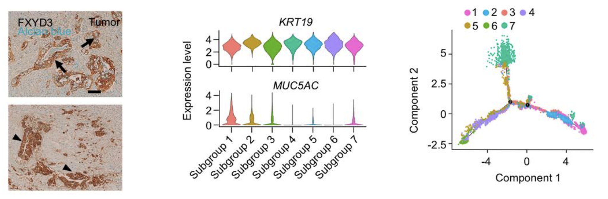
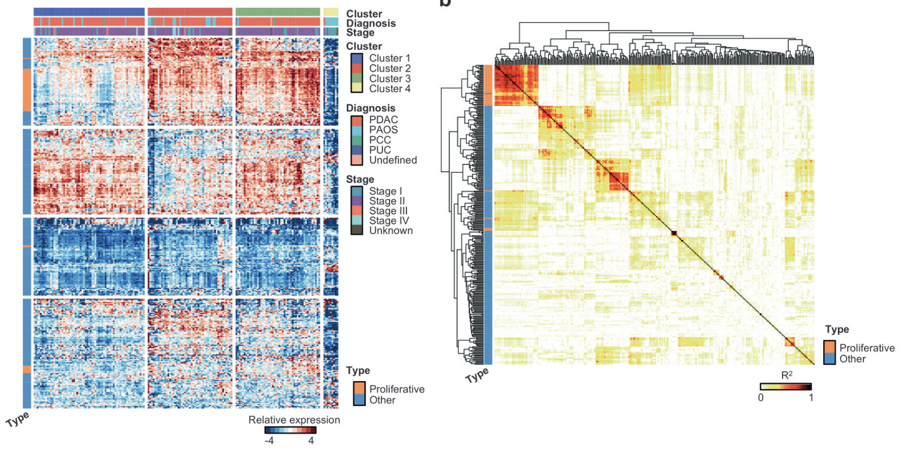
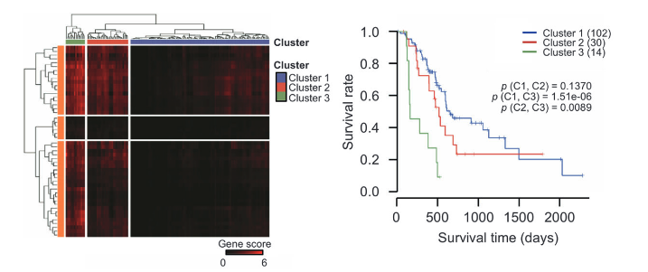
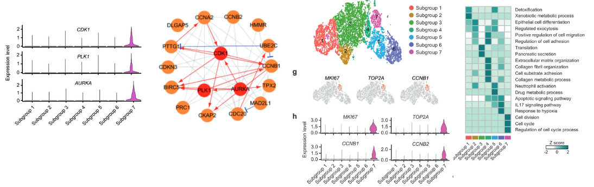
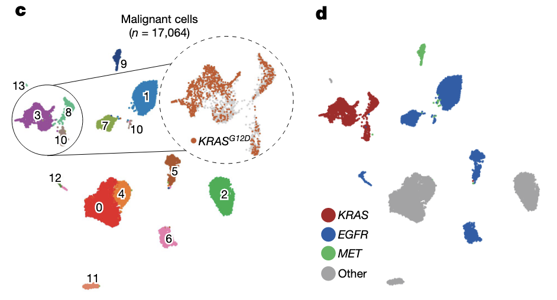
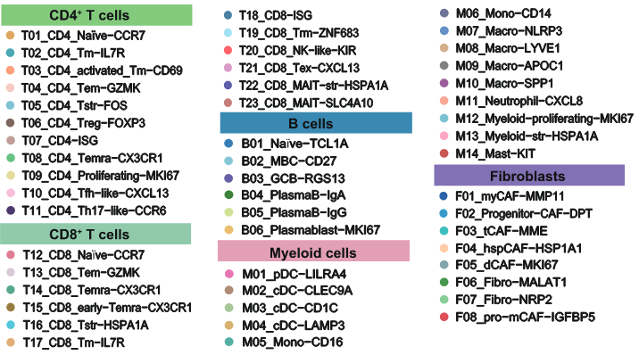

# Single-cell RNA-seq highlights intra-tumoral heterogeneity  and malignant progression in pancreatic ductal  

> 疑问 1：作者搞了一个 excel 文档，里面有 Ductal Top markers，这个或许是分析 DEG 出来的，但是里面又有 proliferative 的亚分类，这是怎么弄出来的？GO？

## Heatmap 展示不同 cluster 之间样本相似性与差异性
> 样本：24例胰腺导管腺癌（PDAC）肿瘤和11个对照胰腺的共57,530个细胞进行了深入的转录组分析。

> 鉴定出了多种不同的恶性细胞和基质细胞亚群，发现存在两种基因表达谱截然不同的导管细胞：一种是基因表达异常的“1型导管细胞”，另一种是恶性的“2 型导管细胞” 。通过**拷贝数变异（CNV）分析证实**，2型导管细胞是主要的恶性细胞来源，在肿瘤组织中显著增多，而在正常组织中则未被发现 。进一步的分析揭示，恶性的 2 型导管细胞内部还包含多个具有不同增殖和迁移潜能的亚群。通过构建细胞演进轨迹，该研究描绘了导管细胞从异常状态向恶性状态转变的过程，并**识别出在此过程中多个关键肿瘤相关通路（如ErbB和Notch信号通路）的动态激活** 。一项重要的发现是，**一个具有高度增殖特征的恶性导管细胞亚群的存在与肿瘤浸润T细胞的失活状态密切相关**，这表明肿瘤细胞自身的转录状态可以影响免疫微环境，从而导致不良预后。

Subgroup 3 cells are the major population present in most patients, suggesting that this subgroup is shared among PDAC patients. In contrast, subgroups 1, 2, 4, 5 and 6 are exclusively observed in some patients, which reflects the tumor heterogeneity of individual patient. 

- 树状图：上方为亚群之间的相似性，左侧为不同病人样本之间的相似性。
- 可视化：pheatmap/ComplexHeatmap
- 思路：查看不同 cluster 之间的分布
  - 分布都比较多 → 共享特征
  - 部分病人很高 → 个体差异大，肿瘤异质性
  - 稀有但广泛存在

## 富集分析揭示与中性粒相关 cluster 用于后续分析

> Roles of subgroup 5 expressed genes were related to neutrophil activation, indicating a possible association with immune response. Notably, genes for both subgroups 4 and 6 were enriched for migration-related terms. Specifically, genes for subgroup 6 were enriched for GO terms such as response to hypoxia and IL17 signaling pathway, emphasizing their potential functions in migration and metastasis.

- 通过富集化分析 → 得到和免疫相关的亚群 → 下一步分析与肿瘤浸润T细胞的失活状态的关系

## 结合免疫组化验证 PDCA 的 PanIN 来源

> PanIN：胰腺导管上皮内瘤变，是最常见的黏液性、导管形态的癌前病变，被认为是 PDAC（胰腺导管腺癌）的重要前体
- L（免疫组化）：
  - FXYD3：作为 type 2 ductal cells 的标志（导管谱系/该亚群富集的膜蛋白）
  - Alcian blue（AB）：组织化学染色，特异偏向于酸性黏多糖/黏液，PanIN 常呈 AB 阳性（黏液性）
    - 1.	FXYD3⁺ 且 AB⁺：说明在 type 2 ductal cells 里有**黏液性（PanIN-like）**成分；
    - 2.	仅 FXYD3⁺（AB⁻）：说明仍是 type 2 ductal cells，但不显著黏液化，更偏PDAC 实性/侵袭阶段的形态。
- M：
  - KRT19：上皮/导管型角蛋白，导管表型强阳性
  - MUC5AC：胃型黏蛋白，PanIN/黏液分化常阳性，PDAC 早期/某些分化型也可表达
  - 认为 KRT19+MUC5AC 是 PanIN
- R：
  - Monocle2 轨迹验证 1,2,3 是比较早期的群体 → 验证 PanIN 可能是PDAC 的起源

## TCGA-PAAD 队列表达模式分析

> TCGA(The Cancer Genome Atlas)：美国国家癌症研究所 (NCI) 和国家人类基因组研究所 (NHGRI) 牵头的超大型癌症基因组计划，从 2006 年到 2018 年，收集了 33 种癌症的上万例患者样本，进行了系统的 基因组、转录组、表观组、蛋白组等多组学测序和临床随访。

> PAAD 队列： 胰腺腺癌（包括胰腺导管腺癌 PDAC 及其其他亚型）的患者样本集合
>  - Bulk RNA-seq
>  - WES DNA 突变数据
>  - CNV
>  - DNA 甲基化
>  - 临床信息：分期、预后、生存时间

- 样本构成：146 PDAC samples; 4 PCC samples: Pancreas-Colloid Carcinoma; 1 PUC sample: Pancreas Undifferentiated Carcinoma; 26 PAOS samples: Pancreatic Adenorcarconoma Other Subtype; 1 sample was the undefined subtype
- 聚类方法 K-means clustering，使用 maftools R 包处理 TCGA 突变（.MAF）
- 行：Ductal top markers → 没有提到具体是怎么做的，Findallmarkers or DEGs
- 结论：cluster 2,3 的增殖 marker 更多；KRAS，TP53，SMAD4 突变在 cluster 1,2,3中显著多；cluster 4 预后显著更好 → 论证了前面的 Ductal top markers 是有意义的，可以区分 PDAC 和其他类型的胰腺癌

对 TCGA-PAAD 的表达矩阵，用 Ductal top markers 计算 gene 的两两相关性 (pairwise correlation, R²)

- 大部分增殖性导管标志物之间 **高度相关**，说明有一致的表达模式 → 可能属于同一个调控网络
- 接着对 PDAC 患者使用 NNMF（无监督非负矩阵分解） 对 增殖性导管标志物的表达水平做聚类
  - 分为三个 cluster → Group 3 患者高表达增殖性导管标志物，生存率显著更低
  - 增殖性导管细胞（带有 proliferative markers）和 PDAC 预后紧密相关

- 接着 对比 cluster3 和其他两个 cluster 做基因差异分析 → 将差异基因做 GO 富集
  - 上调基因 → 富集在 cell cycle、DNA replication、DNA repair 等条目
  - 下调基因 → 富集在 T cell selection、lymphocyte activation 等条目
- 在 单细胞数据 中看这些差异基因的表达分布
  - 上调的增殖相关基因 → 主要在 type 2 ductal cells（肿瘤导管细胞亚群） 表达
  - 下调的免疫相关基因 → 主要在 巨噬细胞和 T 细胞 中表达

## 使用 Ingenuity Pathway Analysis (IPA) 绘制功能性相互作用网络

得到 proliferative markers 核心枢纽基因（hub genes） CDK1, PLK1 and AURKA 可以作为药物靶点

## 高增殖活性患者的 T 细胞抑制/失活更明显

> 核心观点：Ki67 和 CD3D 的表达成反比

- 利用前面 NNMF 聚类的 cluster 分析，发现 cluster 3 的增殖相关高表达，T 细胞激活相关的低表达
- 对 TCGA 使用基因集打分方法，对比一下 CD8 T cell activation score ，在单细胞中验证（好像是随意对比了两个 sample，看看是不是反比例关系？）

# An atlas of epithelial cell states and plasticity in lung adenocarcinoma

> 样本：16 个患者，除肿瘤区域，取了肿瘤邻近区 (tumour-adjacent)、中间区 (tumour-intermediate) 到 远端区 (tumour-distant) 共计 47 个正常 NL 样本，共 47 + 16 个样本

> 很有意思，可以研究随着空间距离的变化，上皮细胞的状态如何过渡

## 预处理 & 分亚群

> Hierarchical clustering of major epithelial subsets was performed on the Harmony batch-corrected PCA dimension reduction space. For malignant cells, except for global UMAP visualization, downstream analyses, including identification of large-scale CNVs, inference of cancer cell differentiation states, quantification of meta-program expression, trajectory analysis and mutation analysis, were performed **without** Harmony batch correction.
>
> 这里好像对恶性细胞除了全局的 UMAP，其余下游分析（大片段 CNV、分化状态、meta-program、轨迹、突变）不做 Harmony 校正，避免过度整合抹掉真实肿瘤内异质性？ ***但是 xhs 和其他 paper 是做的了？***

- 提取子集 → 重新计算 PCA → 直接绘制 UMAP

## CNV、G12D 计算
- CNV：
  - Step 1: 对每条染色体的 臂 (chromosomal arm)，计算该臂上所有 CNV 值的平方均值。$ArmScore = mean(CNV^2)$
  - Step 2: 把所有染色体臂的 score 取平均，得到该细胞的 总体 CNV score（用 R 的 mean() 函数简单平均）
    - 恶性细胞通常 CNV score 较高，而非恶性细胞接近 0
  

> 来自：Sinjab, A. et al. Resolving the spatial and cellular architecture of lung adenocarcinoma by multiregion single-cell sequencing  
> Analysis of large-scale copy number variations and KRAS mutation status
To quantify the level of aneuploidy, profiles of copy number variation (CNV) generated by inferCNV (https://github.com/broadinstitute/inferCNV and as described in Methods section) were aggregated using a strategy similar to that described in a previous study (13). We first computed arm-level CNV scores as the mean of the squares of CNV values across each chromosomal arm. The arm-level CNV scores were further aggregated across all chromosomal arms by taking the arithmetic mean value of the arm-level scores using R function mean. To associate CNV clusters with tumor clonal architecture, we constructed phylogenetic neighbor-joining trees using the R package phangorn for cells from P3 LUAD (14). The consistency between the phylogenetic neighbor-joining tree and the original hierarchical clustering tree was quantified by calculating the Pearson’s correlation coefficient between the orders of cells (clades and clusters) in both trees. P – values were calculated using cor.test function. 
For **single-cell somatic mutation analysis**, we were able to specifically capture and analyze KRAS codon 12 mutation status in our cohort since KRAS codon 12 falls within the genomic bandwidth of our 5’ single-cell gene expression assay, i.e., its locus is present within the first 100 bp from the 5’ end of transcripts sequenced. Reads from P2 samples were extracted from the original BAM files using cell-specific barcodes and genomic coordinates of KRAS codon 12 mutations and then subjected to quality filtering and duplicates removal, mutation identification and annotation. Extracted alignments were manually evaluated using IGV (15). 

- KRAS 突变检测：寄了，好像比如是 5' 测序才可以

# Integrated single-cell and spatial transcriptomics uncover distinct cellular subtypes involved in neural invasion in pancreatic cancer

## 细胞分群命名方法

## 上皮的 经典型（classical） VS 基底型（basal-like）

