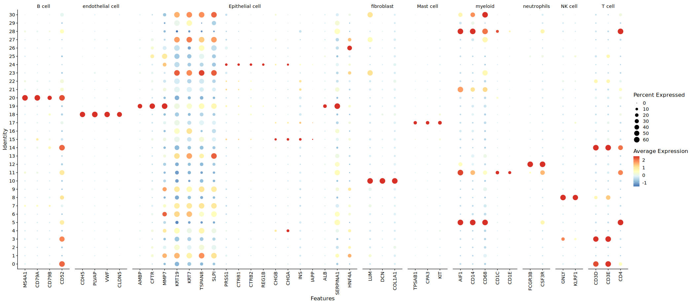
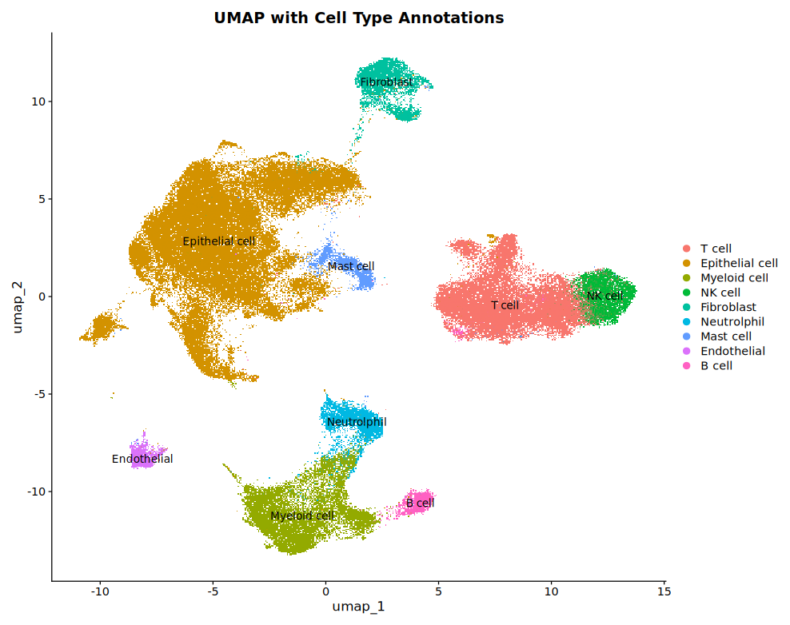
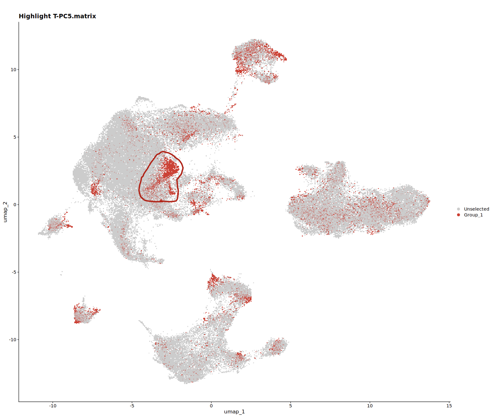
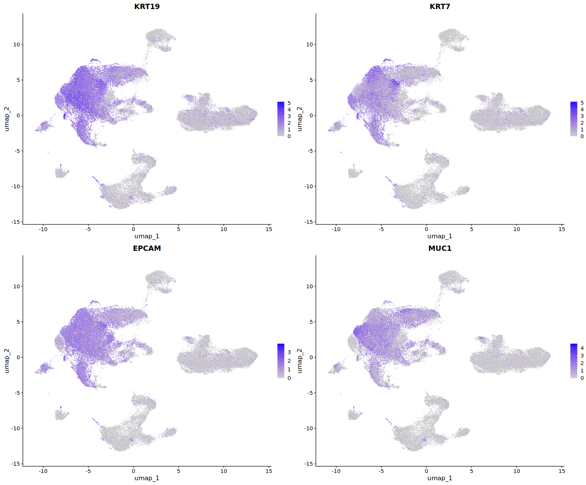
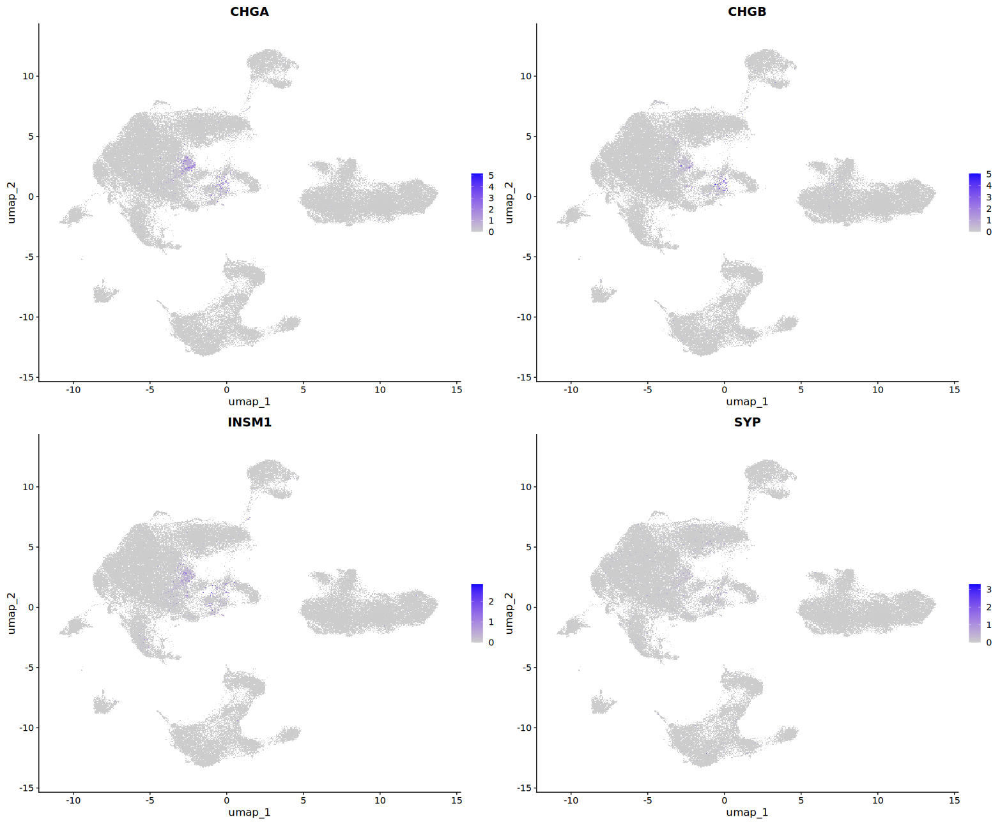
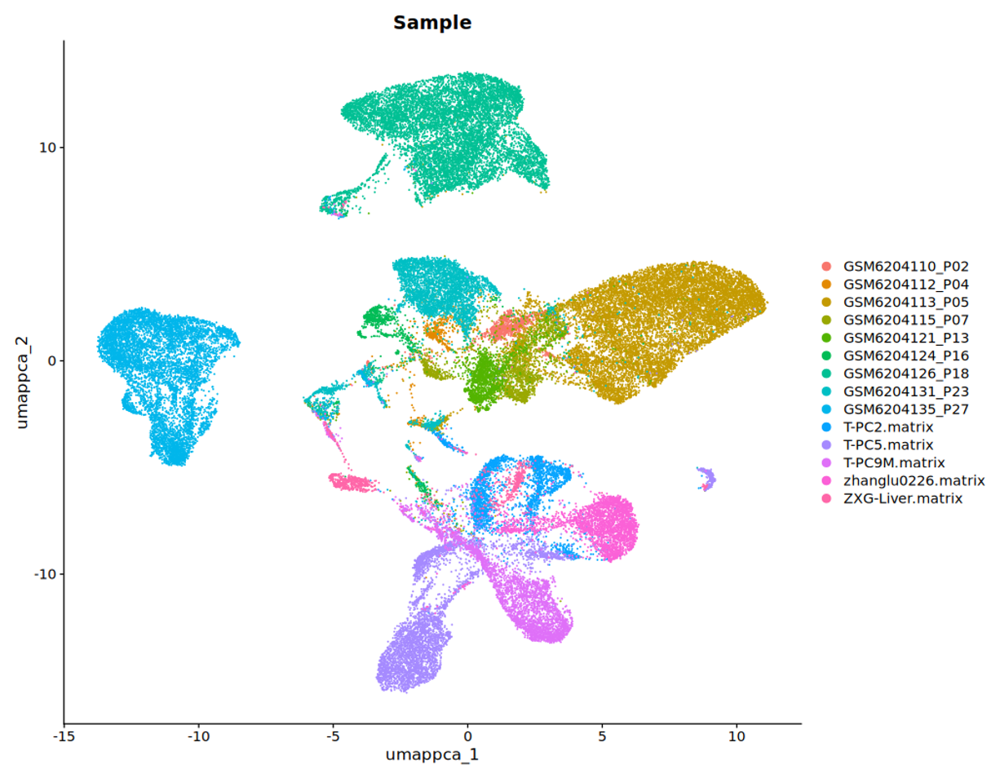

# 2025.8.27

## 1. 重新按照上皮分群

新添加了几个 Hepatocyte 的 marker：ALB、SERPINA1、HNF4A

PC=25
Res=0.8

T-PC5 的样本怀疑可能是神经内分泌肿瘤？

只有 EPCAM 的上皮成分，未见 KRT17 & KRT9 高表达

但是可以看到内分泌相关 marker 是高的

## 提取上皮后不做 Harmony

