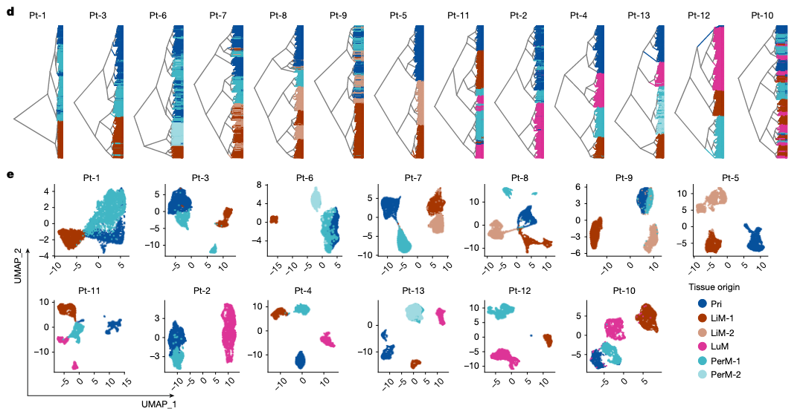
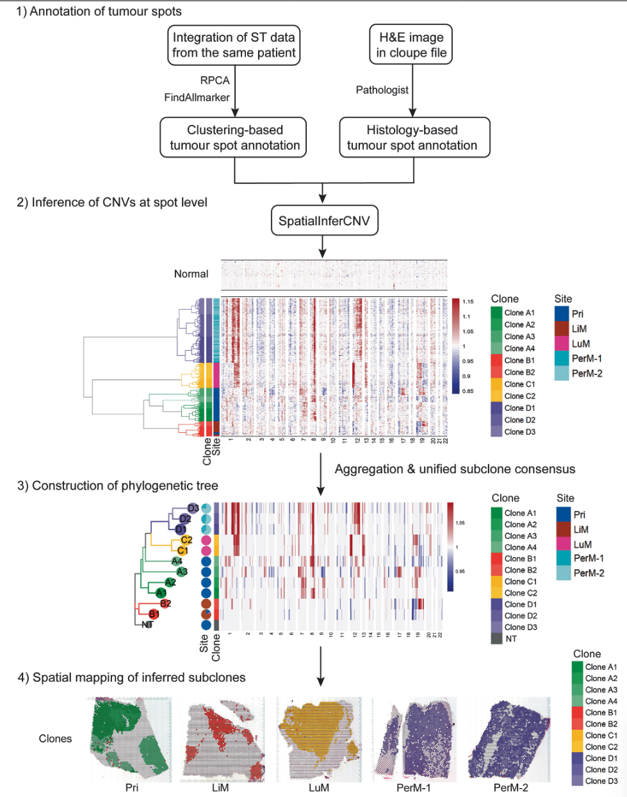

# 1. Spatial mapping of transcriptomic plasticity in metastatic pancreatic cancer

> 主要发现：
> - 肿瘤谱系状态（lineage states）存在显著转录组漂移：同一位患者的肝转移和肺转移之间差异尤其明显 → 肿瘤细胞在不同器官微环境下呈现器官特异的演化路径。
> - 克隆进化的个体差异性：用CNV 变化推断系谱树（phylogenetic trees），不同患者呈现出不同的克隆演化与播散轨迹 → 转移并非单一路径，而是高度个体化的演化过程。
> - 多种谱系状态在同一组织共存：同一器官内的不同转移灶可能具有不同的谱系状态 → 转移并非单克隆，而是多克隆共存与竞争的复杂生态。

| 癌细胞状态 | 微环境特征 | 结果 |
|-------------|--------------|------|
| **Basal-like（侵袭性强）** | 紧邻 **TGFB1⁺ 的肌成纤维样 CAF（myCAF）** | **促侵袭性、免疫排斥** |
| **Classical / Intermediate** | 与 myCAF 无特异空间耦合 | 免疫排斥不明显 |

Basal-like细胞和myCAF的邻近区域中，浆细胞显著减少（plasma-cell exclusion）→ CXCR4–CXCL12信号轴可能驱动这种免疫排斥

## 1.1 无监督聚类层次聚类

原理：把样本根据“相似度”逐步聚在一起，形成树状图

结论：Pri 和 PerM 之间的层级关系更紧密

注意这里通过 InferCNV 已经搞到了所有肿瘤 Spot，再进行相似性分析，这样可以确保每一个样本都是肿瘤细胞

Space Ranger 处理原始 reads
→ 生成 UMI count matrix
→ 导入 Seurat (v4.3)
→ NormalizeData + ScaleData
→ FindVariableFeatures (选取 2000 HVGs)
→ PCA（取前 30 PCs）
→ FindNeighbors (构建 SNN 图)
→ FindClusters (res = 0.5，无监督聚类)
→ RunUMAP (二维降维可视化，形成 1.c)
→ 识别 tumour-cell-enriched spots（通过病理 + CNV + 表达特征）
→ 整合原发灶与转移灶的 tumour-rich spots（Seurat reciprocal PCA）
→ 计算欧氏距离 (Euclidean distance)
→ ***使用 Ward’s linkage method 构建层次聚类树（hierarchical clustering / unrooted phylogenetic tree）***
→ ggtree 可视化树结构（dendrogram 展示 Pri/LuM/LiM/PerM 相似度）
→ 在 UMAP 上按器官来源投影颜色展示（验证组织特异性聚类）

## 1.2 ST 的 InferCNV

使用 SpatialInferCNV（cutoff = 0.1, cluster_by_groups = FALSE, HMM = FALSE and denoise = TRUE），无需**解卷积**
| **参数**                      | **功能**               | **含义**                                                  |
| ----------------------------- | ---------------------- | --------------------------------------------------------- |
| **cutoff = 0.1**              | 过滤低信号基因         | 忽略极低表达的噪声信号；仅保留高置信度 CNV 区段。         |
| **cluster_by_groups = FALSE** | 是否按预定义分组聚类   | 不强制以组织类型（Pri/LiM等）为分组；让数据自行形成模式。 |
| **HMM = FALSE**               | 是否启用隐马尔可夫模型 | 不用 HMM 平滑，避免因spot间空间异质性导致误判。           |
| **denoise = TRUE**            | 是否去噪               | 开启信号平滑，提升 CNV 热图的可读性。                     |

### 1.2.1 参考选择

# 2. Spatial transcriptomic analysis of primary and metastatic pancreatic cancers highlights tumor microenvironmental heterogeneity

## 2.1 质量控制 —— SpotClean

•	maxit = 10（最大迭代次数）

•	r = 20（邻域半径，定义潜在扩散范围）

1. 低质量 spot 剔除（基因数 < 200，UMI 数 < 200）视为低质量或噪声 spot，剔除。
2. 利用 PercentageFeatureSet() 去除非生物学信号基因：mitochondrial, hemoglobin, empty droplet barcode, ribosomal, heat shock and dissociation genes