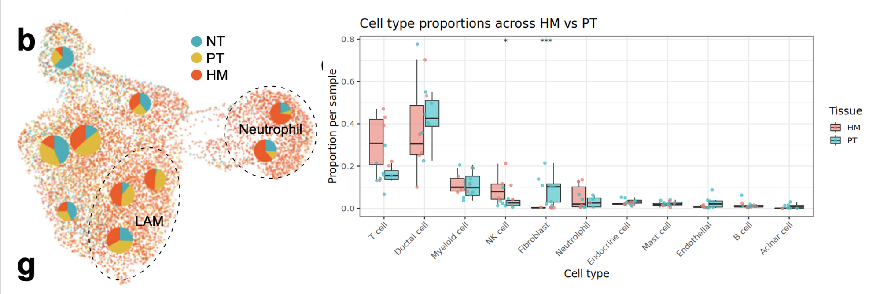
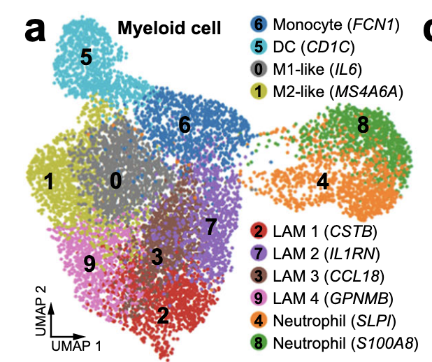
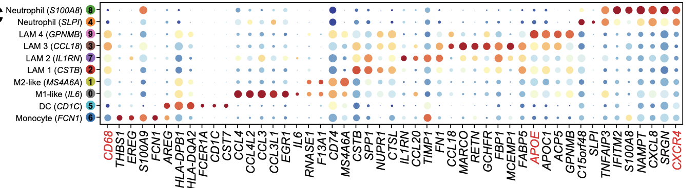
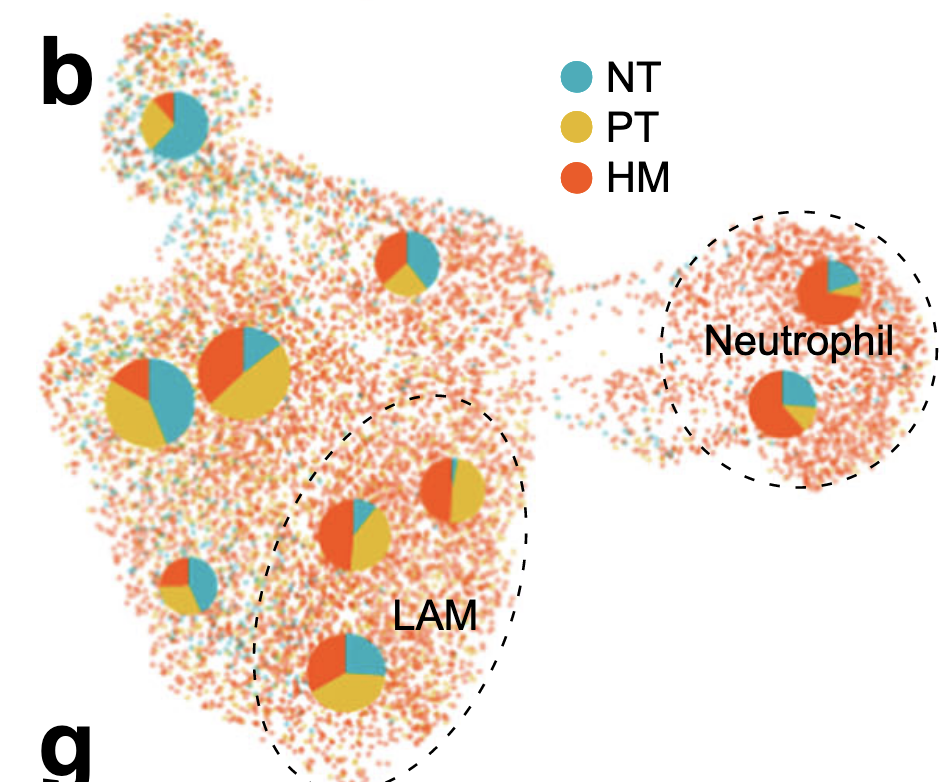
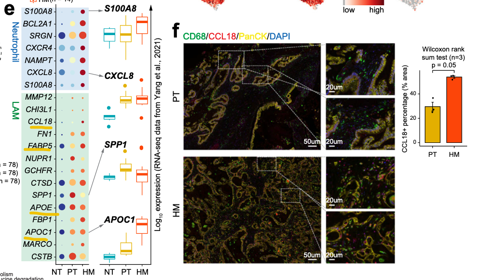
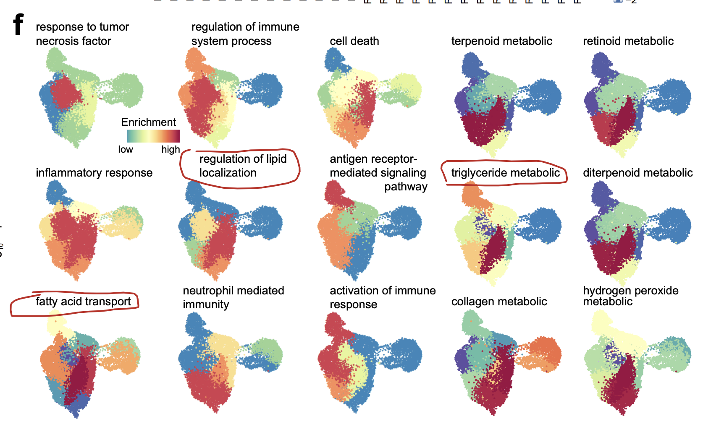
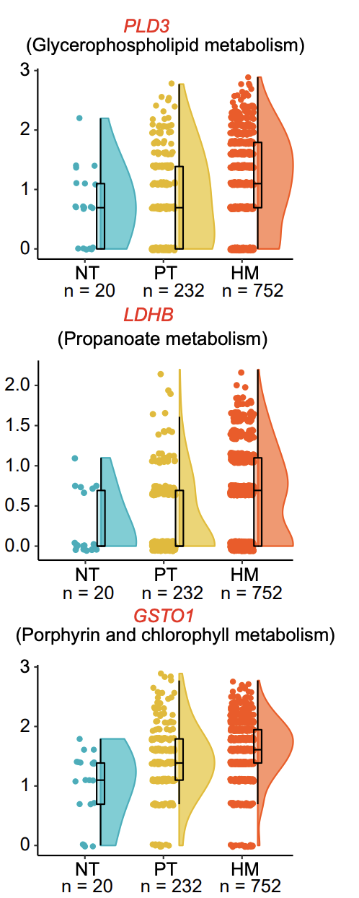
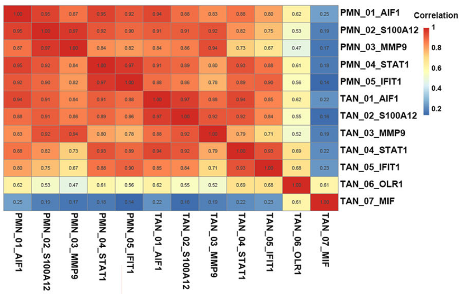
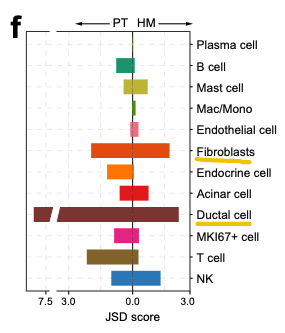

# 1. Necroptosis enhances ‘don’t eat me’ signal and induces macrophage extracellular traps to promote pancreatic cancer liver metastasis

# 2. Single cell transcriptomic analyses implicate an immunosuppressive tumor microenvironment in pancreatic cancer liver metastasis

Monocle2 对导管上皮进行轨迹分析，发现沿着轨迹 1 KRAS(KLK7, ERO1A, SPRR3, TFF2, and AKR1B10) 上调，as well as hypoxia response and pro-inflammatory signaling genes (ATF3, JUN, EGR1, IER2, LITAF, FOS, LAMB3, ERO1A, S100A4, and KLF2)。其终末为 S5，
## 2.1 脂质相关巨噬细胞 LAM 在 PDAC 肝转移中起重要作用
### 2.1.1 从比例入手发现 Macro/Mono 重要性
首先观察到 Macro/Mono 在 HM 的组织中占比明显升高 → 但是 Tricky 的是作者进一步画的图中好像 neut 的比例在 HM 中是明显更高的，剩下的在 PT 感觉还会多一些

### 2.1.2 细分亚群
作者这里分类 10 个 subcluster：

- Mono：FCN1, S100A9, EREG, and THBS1
- Classical DC：CD1C, CST7, and FCER1A（most likely originated from normal pancreatic tissues）
- Macrophage：CD68+ 
  - M1 like
  - M2 like
  - 4 个 LAM（lipid-associated macrophages）：除了高 CD68，还有很高的脂代谢相关 marker（APOE, APOC1, and FABP5）
    - LAM
    -  1,2 高 **SPP1** → TAM 分泌促进癌症
    -  3,4 高 **CCL18** → 免疫抑制 & 促肿瘤

LAM1、2、3 在肿瘤中明显更多

> CD68: 溶酶体相关膜蛋白（LAMP）家族，吞噬作用、溶酶体活性和细胞内物质降解

> 分布: 巨噬细胞（经典）、单核细胞、 DC & 粒细胞（低水平）

### 2.1.3 LAM 在 HM 中富集，看上调的通路

进一步探究，LAM3 在 HM 明显增多？？

脂代谢相关 APOC1、APOE、FABP5 和 免疫相关 CCL18 在 HM 中表达更多（但是看 Dotplot 感觉没有很显著）

> scMetabolism：看代谢

> Go 富集对比 LAM3 的 HM，PT，NT

> DEG: PLD3、LDHB、GSTO1 上调 **没有进一步探究**

一个很 tricky 的点，绘图的时候用 z Scale 一下，直接放大区别！

# 3. Single-cell transcriptome analysis identifies MIF as a novel tumor-associated neutrophil marker for pancreatic ductal adenocarcinoma

> 结合 bulk RNA-seq 和 单细胞 RNA 测序（scRNA-seq），对 PDAC 样本中的中性粒细胞进行分类，发现 7 个不同亚群 的中性粒细胞。

> 肿瘤相关中性粒细胞 TAN：Oxidized low-density lipoprotein receptor 1 (OLR1)+ neutrophils &  macrophage migration inhibitory factor (MIF)+ neutrophils

> 在 PDAC 样本（16 + 3 正常）、原位胰腺肿瘤小鼠模型、患者来源的异种移植 PDX 模型验证 → **功能：促进 PDAC 的增殖 & 迁移，机制上激活 ERK 和 AKT 信号通路，诱导 EMT**

- 中性粒正常功能：攻击肿瘤细胞 & 参与抗肿瘤耐药
- TAN：TME 的组成部分，促进肿瘤转移，血管新生，免疫抑制
  - 调控 T cell 免疫监视
  - 降低 细胞毒性化疗药物疗效
  - 中性粒来源的 TNF-a 维持免疫抑制 & 基质炎症
  - 化疗联合治疗时，如果 阻断中性粒细胞浸润 或 抑制 Gas6/AXL 信号通路，可以显著抑制 转移性 PDAC 的生长

## 3.1 分群
### 3.1.1 Spearman 相关系数 看亚群相似性

1. 在每个亚群中，取出 标准差最大的前 1000 个基因，计算它们的平均表达
2. 对外周血亚群（PMN_01–05）和肿瘤内亚群（TAN_01–07）之间做 Spearman 相关性分析

> 相似方法： 
> 1. 欧几里得距离 (Euclidean distance)：常见于 PCA 或聚类
> 2. Jensen-Shannon divergence (JSD)：比较概率分布相似性，在单细胞里常用来衡量 不同样本间 cell-type composition 的差异。
> 3. Label transfer (Seurat TransferData)：把 PMN 的标签转移到 TAN，看哪些 TAN 细胞最可能和 PMN 对应
> 4. Bhattacharyya Distance：比较不同组之间 细胞组成分布差异
> 5. Wasserstein / Earth Mover’s Distance, EMD：比较不同队列/不同状态的表达谱差异

### 3.1.2 

# 4. IL-1β+ macrophages fuel pathogenic inflammation in pancreatic cancer

> IL-1b+ 亚群

空间多组学的实现方式
- 组织来源：新鲜冷冻切片 或 福尔马林固定石蜡包埋 (FFPE) 
- 策略：
  - 在相邻切片 (adjacent sections) 上分别做不同组学
    - 优点：避免多轮实验破坏组织质量
    - 缺点：需要对齐（co-registration），空间精度受限
  - 在同一切片 (serially) 上依次做多个组学
    - 条件：需要保证组织在第一轮实验后依然保留足够的分子信息
    - 优点：空间对应关系最好
    - 缺点：实验条件要求高
  - 在同一切片 (in parallel) 同时检测多种分子
    - 借助特定的 探针设计或化学策略，能一次性读出多种分子信息
    - 优点：信息最全面，避免切片间差异
    - 缺点：方法复杂，目前可同时检测的分子种类有限
- 空间多组学结果通常会和 组织学染色 (如 H&E 染色) 联合

空间多组学的发展

- 基于阵列 (array-based) 的空间转录组学
  - 原理：在玻片上预先布置好 带有空间条形码 (spatial barcode) 的捕获探针，每个位置（spot/bead/nanoball）有独特的 DNA 序列标记
    - 将组织切片固定并透化 → 释放细胞内的 mRNA
    - mRNA 被捕获到下方玻片/珠子的 寡聚 dT 探针 上（识别 poly(A) 尾）
    - 反转录生成带有空间条码的 cDNA → 建库 → 高通量测序
    - 根据条码信息，将每条测序读数 映射回组织切片的具体位置
  - 常见方法：
    - **固定阵列 (arrayed barcoded spots)**：10x Genomics Visium & Spatial Transcriptomics (ST)
      - 在玻片上打印有 数千个位置固定的 oligo-dT spots，每个 spot 有唯一条码
      - 优点：流程成熟，商业化程度高
      - 局限：spot 尺寸较大（~50 µm），往往覆盖多个细胞 → 分辨率限制
    - **随机分布的条码微珠 (barcoded beads)**：Slide-seq & HDST (High-Definition Spatial Transcriptomics)
      - 使用 带条码的珠子 铺在玻片表面，每个珠子直径 ~10 µm
      - 分辨率比 Visium 高，接近单细胞水平
      - 需要珠子位置的 高精度解码 (bead decoding)，实验难度更高
    - **DNA纳米球阵列 (DNA nanoballs)**：Stereo-seq华大
      - 在玻片上布置 亚微米级的条码 DNA 球 (nanoballs)，可以实现 亚细胞分辨率
      - 是目前分辨率最高的空间转录组之一

## Spatial multi-omics via adjacent-section strategies

- 单细胞多组学的数据整合策略分类
  - 水平整合 (Horizontal integration)
    - 锚点 (anchor)：共同特征 (common features)
    - 应用场景：不同批次/不同实验得到的数据，但测的是 相同分子层次 —— 多个批次的 scRNA-seq 数据；或者 10x RNA-seq 和 Smart-seq RNA-seq
    - 方法特点：对齐相同的基因/蛋白特征，做 batch correction
    - 代表方法：
      - Seurat CCA/Anchors
      - Harmony
      - Scanorama
      - LIGER (shared/non-shared factor 分解)
    - 应用：用于 细胞图谱 (cell atlas) 建设，因为要把大量批次的单细胞数据合在一起
  - 垂直整合 (Vertical integration)
    - 锚点 (anchor)：细胞 (cell) 本身
    - 应用场景：在 同一细胞 上同时测量多个组学 (multi-omics)：scRNA + scATAC (10x Multiome), scRNA + 蛋白 (CITE-seq)
    - 方法特点：每个细胞的数据有多个“视角”，需要联合建模，用多模态一起定义细胞身份
    - 代表方法：
      - Seurat WNN (Weighted Nearest Neighbor)
      - MOFA+ (Multi-Omics Factor Analysis)
      - totalVI / multiVI (基于深度学习的贝叶斯框架)
    - 是 **大多数多组学技术的核心需求**
  

# Integrated single-cell and spatial transcriptomics uncover distinct cellular subtypes involved in neural invasion in pancreatic cancer

> 总样本：25 位未治疗的 PDAC 患者
> 
> 21 张切片（16 张 FFPE + 5 张冷冻组织），在 10x Visium 平台上做 ST
> 
>  81,714 个 spots,每个 spot 中位数有约 8,705 个 UMI / 4,220 个基因

## 空转方法学
### 1. 预处理
1. 数据预处理 (Preprocessing)
	- 原始输入：Visium 平台的测序结果，包括 demultiplex 后的 FASTQ 文件 + 对应 H&E 染色切片图像
	- 软件：Space Ranger
	- 步骤：
  	- 使用 count 命令，对每个样本的 FASTQ 和 H&E 图像进行处理
  	- 输出：得到 feature-barcode 矩阵 **（unfiltered + filtered 两个版本）**
    	- 行：基因（features）
    	- 列：空间位置的 barcode（即一个个 spot）
    	- 值：**该基因在该 spot 上的 UMI 数**
  	- HE 作用：提供 组织形态学信息 → H&E 图像和 Visium 芯片的 capture area 进行配准（align），确定每个 spot 对应组织里的哪个位置
    	- 质控：帮助剔除没有组织覆盖的 spot（比如玻片边缘、空白区域）
    	- 解释性：后续可以把基因表达图谱和病理形态结合，比如看哪个 cluster 对应肿瘤区、间质区或坏死区
    	- Unfiltered matrix：所有 barcode 的基因表达，包括空白区域
    	- Filtered matrix：去掉了没有组织覆盖、低质量的 barcode，只保留真实组织上的 spot

2. 构建 Seurat 对象
	- 将 filtered matrix 导入 R 中，使用 Load10X_Spatial 构建 Seurat 对象
	- 每张切片（slide）都单独建 Seurat object
	- 标准化 & 批次校正：
    	- SCTransform —— vars.to.regress = c('**nCount_Spatial**')，回归掉测序深度的影响
        	- 不回归 mitoRatio → 避免把空间组织学特征误删，因为线粒体比例在 ST 里可能本身就是一个 空间模式（例如肿瘤坏死区 vs 间质区）	
      	- 多个对象合并后，利用 Harmony 对 PCA 结果进行批次校正（group.by.vars = c('orig.ident', '**technique_type**')）
        	- 不同组织制备方式的样本需要矫正！

3. 降维与聚类
   - 邻居图构建：用 FindNeighbors
   - 聚类：用 Louvain 算法，基于前 30 个 PCA 维度 (FindClusters)
   - 可视化：RunUMAP 基于 Harmony 校正后的前 30 个主成分，生成二维嵌入

4. **细胞类型解卷积 (Cell type deconvolution)**
   - 算法：RCTD (Robust Cell Type Decomposition)，来自 spacexr 包
   - 模式：full mode（更严格）
   - 参考：之前已经注释好的胰腺癌 sc/snRNA-seq 数据集
   - 输出：每个 spot 的细胞类型比例矩阵
   - 标准化：确保每个 spot 的比例和为 1

5. 空间生态位 (**Spatial niches**)
	- 定义：spot 群体，表现为相似的细胞类型组成。
	- 步骤：
	- 在高分辨率 (resolution = 2) 下聚类 spot。
	- 计算每个 cluster 的平均细胞类型比例。
	- 结合 UMAP 分布 & H&E 图像位置进行注释。
	- 最终：识别出 12 个不同的空间生态位 (spatial niches)。

6. 分组比较 (High-NI vs Low-NI)
	- 研究对象：神经侵犯 (Neural Invasion, NI) 高 vs 低的 PDAC 样本。
	- 方法：
    	- 计算每个样本的 12 个 niche 所占比例
    	- 用 ridge plot 展示分布差异

7. 外部验证 (Validation)
	- 验证队列：
    	- 公共 PDAC ST 数据集 (n=8)
    	- 自采独立样本 (n=2)
	- 神经侵犯 (NI) 状态由两名病理医师独立判定
	- 同样跑一遍 RCTD → 得到 cell type 分布 → 比较高 vs 低 NI

### 2. Spatial vicinity analysis（空间邻近性分析） 

